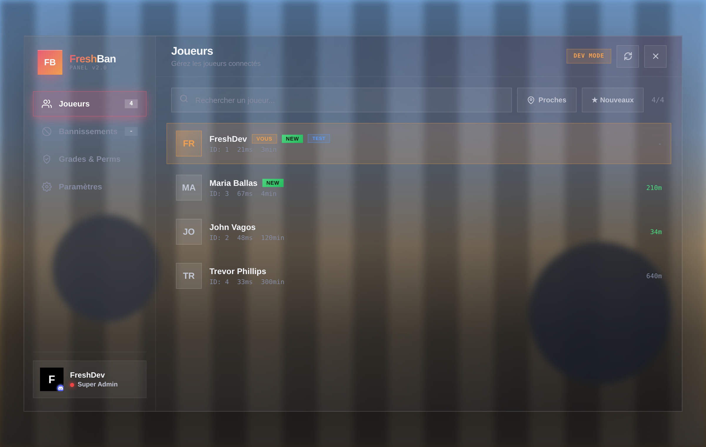
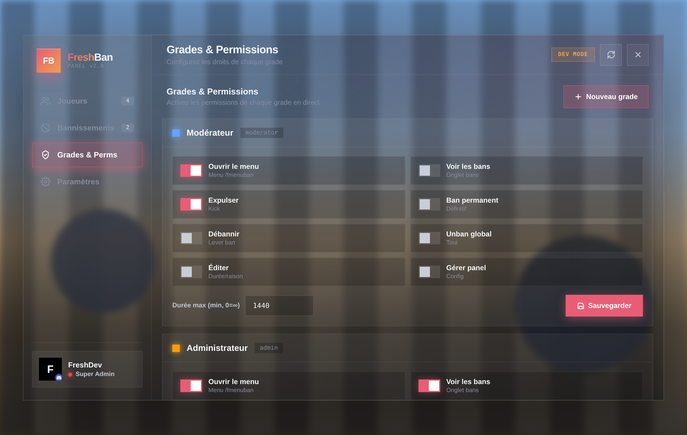
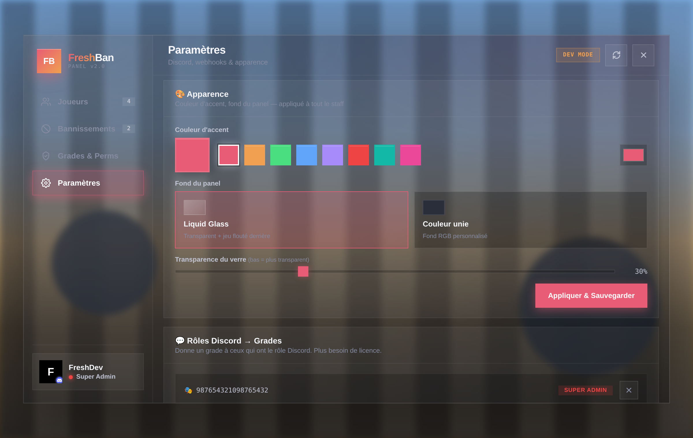

# FreshBan

> Panel de bannissement et de modération pour FiveM moderne, sécurisé, et 100 % configurable en jeu.

<p align="center">
  
  
  
  
</p>

FreshBan remplace les scripts de ban « fichier texte » et les commandes à rallonge par un
véritable panel d'administration. Tout se gère depuis l'interface : sanctions, grades,
permissions, webhooks et apparence. La base de données s'installe seule et la première
configuration se fait en une commande pas de SQL à importer, pas d'`add_ace` à écrire.

---

## Sommaire

- [Fonctionnalités](#fonctionnalités)
- [Aperçu](#aperçu)
- [Installation](#installation)
- [Première configuration](#première-configuration)
- [Intégration Discord](#intégration-discord)
- [Commandes](#commandes)
- [Sécurité](#sécurité)
- [Structure du projet](#structure-du-projet)
- [FAQ](#faq)
- [Licence](#licence)

---

## Fonctionnalités

- **Panel complet** — liste des joueurs, historique des bans, gestion des grades et paramètres, le tout dans une seule interface.
- **Ban IDs uniques** — chaque sanction reçoit un identifiant court (`F0001`) pour un suivi facile.
- **Sanctions flexibles** — durées prédéfinies ou personnalisées (`30min`, `2h`, `3j`, `1m`, permanent), kick, édition et levée de ban.
- **Grades & permissions en direct** — activez/désactivez chaque droit par grade, créez vos propres grades, sans redémarrage.
- **Rôles Discord → grades** — liez un rôle Discord à un grade ; le staff n'a plus besoin de copier des licences.
- **Webhooks par type d'action** — une URL distincte pour les bans, unbans, kicks et logs admin.
- **Apparence personnalisable** — couleur d'accent, fond en verre translucide ou couleur unie, réglable à la volée.
- **Installation automatique** — les tables SQL sont créées au démarrage.
- **Sécurisé par défaut** — chaque action est revérifiée côté serveur (voir [Sécurité](#sécurité)).

---

## Aperçu

> Ajoutez vos captures dans un dossier `docs/` puis référencez-les ici.

```md



```

---

## Installation

**Prérequis :** [`oxmysql`](https://github.com/overextended/oxmysql)

1. Placez le dossier `freshban` dans vos `resources/`.
2. Ajoutez la ressource à votre `server.cfg` :
   ```cfg
   ensure oxmysql
   ensure freshban
   ```
3. Démarrez le serveur. Les tables sont créées automatiquement au premier lancement.

C'est tout — aucun fichier SQL à importer manuellement.

---

## Première configuration

Au premier démarrage, un code s'affiche dans la console du serveur :

```
[FreshBan] Première configuration : tapez /fbsetup 4821 en jeu pour devenir propriétaire.
```

En jeu, tapez la commande affichée :

```
/fbsetup 4821
```

Vous devenez alors **propriétaire (Super Admin)**. Ouvrez ensuite le panel avec `/fmenuban`
et gérez le reste (staff, webhooks, apparence) depuis l'onglet **Paramètres**.

Le code n'apparaît qu'au premier lancement et n'est visible que dans votre console : personne
d'autre ne peut s'attribuer le rôle.

---

## Intégration Discord

Optionnelle, mais recommandée. Elle affiche le pseudo et l'avatar Discord du staff et permet
d'attribuer les grades par rôle Discord.

1. Créez une application sur le [portail développeur Discord](https://discord.com/developers/applications) → **Bot** → **Reset Token**.
2. Dans l'onglet **Bot**, activez **Server Members Intent**.
3. Invitez le bot sur votre serveur (OAuth2 → URL Generator → scope `bot`).
4. Activez le **Mode développeur** Discord, puis clic droit sur votre serveur → **Copier l'ID**.
5. Renseignez `config.lua` :

   ```lua
   FreshBan.DiscordBot = {
       Enabled  = true,
       BotToken = "votre_token",
       GuildId  = "id_du_serveur",
       RoleGrades = {
           ["id_du_role_staff"] = "superadmin",
       },
   }
   ```

Les liaisons rôle → grade supplémentaires se gèrent directement dans le panel
(**Paramètres → Rôles Discord**). Le token reste côté serveur et n'est jamais envoyé au client.

---

## Commandes

| Commande | Accès requis | Description |
|---|---|---|
| `/fmenuban` | `CanUseFMenu` | Ouvre le panel |
| `/fbanlist` | `CanViewBanList` | Ouvre le panel sur l'onglet Bannissements |
| `/freshban [id] [durée] [raison]` | selon le grade | Bannit un joueur en ligne de commande |
| `/funban [banId]` | `CanUnban` | Lève un ban |
| `/funban all` | `CanUnbanAll` | Lève tous les bans (whitelist config) |
| `/fpermban` | — | Affiche vos permissions |
| `/fbsetup [code]` | — | Configuration initiale du propriétaire |

Formats de durée acceptés : `30min`, `1h`, `6h`, `1j`, `3j`, `1m`, `0` (permanent).

---

## Sécurité

La NUI n'est qu'une interface : elle ne prend **aucune** décision. Chaque clic déclenche un
événement serveur, et le serveur reste la seule autorité.

- **Revérification systématique** — le grade du joueur est recalculé côté serveur à chaque action sensible.
- **Liste blanche des permissions** — toute clé de permission inconnue est rejetée.
- **Validation stricte des entrées** — couleurs hex, URLs de webhook Discord, formats d'identifiants et clés de grade sont contrôlés.
- **Anti-spam** — limitation de fréquence sur les actions de gestion.
- **Requêtes paramétrées** — aucune concaténation d'entrées utilisateur dans le SQL.
- **Journalisation** — bans, unbans, kicks et modifications de configuration sont enregistrés.

Un cheat qui déclencherait manuellement un événement `freshban:*` sans avoir le grade requis
est simplement ignoré.

---

## Structure du projet

```
freshban/
├─ fxmanifest.lua
├─ config.lua          Configuration et valeurs par défaut
├─ client/
│  └─ main.lua         Pont NUI (présentation uniquement)
├─ server/
│  └─ main.lua         Logique métier et sécurité
├─ html/
│  └─ index.html       Interface du panel
└─ sql/
   └─ freshban.sql     Schéma (créé aussi automatiquement)
```

---

## FAQ

**Faut-il importer le SQL à la main ?**
Non. Les tables sont créées au démarrage. Le fichier `sql/freshban.sql` reste fourni pour une
installation manuelle si vous le préférez.

**Puis-je continuer à utiliser les permissions ACE (`add_ace`) ?**
Oui. Passez `FreshBan.Permissions.UseAce = true` dans `config.lua`. C'est désactivé par défaut.

**Le fond en verre affiche un rectangle noir / ne montre pas le jeu.**
Assurez-vous d'être en mode `glass`. FreshBan floute le jeu via une native GTA plutôt que par
CSS (le `backdrop-filter` n'est pas rendu correctement dans la NUI de FiveM). Réglez la
transparence dans **Paramètres**.

**Est-ce compatible ESX / QBCore ?**
FreshBan est standalone et n'a pas besoin d'un framework. Le champ `FreshBan.Framework` est
présent pour d'éventuelles extensions.

---

## Licence

Distribué sous licence MIT. Voir [`LICENSE`](LICENSE).

---

<p align="center"><sub>FreshBan — développé par Fresh&Dev</sub></p>
